# MPSOC 芯片详细架构图

```mermaid
graph TB
    subgraph CLOCK["时钟系统"]
        OSC["外部晶振"]
        CPU_PLL["CPU PLL<br/>N/M/OD/Bypass"]
        ESC_PLL["ESC PLL<br/>N/M/OD/Bypass"]
        PN_PLL["PN PLL<br/>N/M/OD/Bypass"]
        CLK_DIV["外设时钟分频器<br/>(TBD)"]
        OSC --> CPU_PLL -->|375MHz| CPU_BUS["CPU 总线"]
        OSC --> ESC_PLL -->|400MHz| ESC_BUS["ESC 总线"]
        OSC --> PN_PLL -->|125MHz| PN_SWITCH["PN Switch"]
        OSC --> CLK_DIV
    end

    subgraph CPU["双核 RISC-V 子系统"]
        CORE0["RISC-V E906 Core 0<br/>BootROM / 主控"]
        CORE1["RISC-V E906 Core 1<br/>辅助处理"]
        IAHB0["I-AHB<br/>16KB"]
        DAHB0["D-AHB<br/>16KB"]
        IAHB1["I-AHB<br/>16KB"]
        DAHB1["D-AHB<br/>16KB"]
        JTAG["JTAG Debug<br/>可禁用"]
        CORE0 --- IAHB0
        CORE0 --- DAHB0
        CORE1 --- IAHB1
        CORE1 --- DAHB1
        CORE0 --- SW_INT0["SW_INT<br/>0x74"]
        CORE1 --- SW_INT1["SW_INT<br/>0x78"]
        JTAG --- CORE0
        JTAG --- CORE1
    end

    subgraph MEM["存储系统"]
        SOC_MEM["SOC Shared Memory<br/>64KB"]
        BOOT_ROM["Boot ROM<br/>16KB"]
        OTP_USER["OTP (用户)<br/>96bit"]
        OTP_VER["Version OTP<br/>96bit"]
        SDRAM_CTRL["SDRAM Controller"]
        SDRAM["外部 SDRAM"]
        QSPI_CTRL["QSPI Controller"]
        SPI_FLASH["外部 SPI Flash"]
        SDRAM_CTRL --> SDRAM
        QSPI_CTRL --> SPI_FLASH
    end

    subgraph BUS["总线互联"]
        AHB_MATRIX["AHB 总线矩阵"]
        DMA["DMA Controller<br/>4 Channels"]
        DMA_CH0["CH0: QSPI→SDRAM"]
        DMA_CH1["CH1: SDRAM→SDRAM"]
        DMA_CH2["CH2: SecureIP→SDRAM"]
        DMA_CH3["CH3: SDRAM→SecureIP"]
        DMA --- DMA_CH0 & DMA_CH1 & DMA_CH2 & DMA_CH3
    end

    subgraph ETH["工业以太网子系统"]
        subgraph ECAT0["EtherCAT 0 (外部通信)"]
            ESC0_CORE["ESC IP Core<br/>base 0x44c80000"]
            ESC0_PDI["PDI 接口<br/>SPI/UC"]
            ESC0_SYNC["Sync0 / Sync1"]
            ESC0_MII["MII / LVDS"]
        end
        subgraph ECAT1["EtherCAT 1 (背板同步)"]
            ESC1_CORE["ESC IP Core<br/>base 0x44c00000"]
            ESC1_PDI["PDI 接口"]
            ESC1_SYNC["Sync0 / Sync1"]
            ESC1_MII["MII / EBUS / LVDS"]
        end
        subgraph PN["PROFINET 子系统"]
            PN_CORE["PN IP Core<br/>v1.2.0"]
            PN_CONSUMER["Consumer Process RAM<br/>→ 4KB"]
            PN_PROVIDER["Provider Process RAM<br/>→ 4KB"]
            PN_ACYCLIC["非周期通道<br/>Channel 0/1"]
        end
        ECAT0_CORE --- ESC0_PDI & ESC0_SYNC & ESC0_MII
        ECAT1_CORE --- ESC1_PDI & ESC1_SYNC & ESC1_MII
        PN_CORE --- PN_CONSUMER & PN_PROVIDER & PN_ACYCLIC
        ESEL["协议选择<br/>system reg[0]<br/>1:ECAT 0:PN"]
    end

    subgraph SEC["安全子系统"]
        SECURE_IP["SecureIP<br/>v1.2.0<br/>base 0x40012000"]
        SEC_BOOT["Secure Boot<br/>可 Bypass"]
        JTAG_LOCK["JTAG 禁用<br/>reg 0x20[0]"]
        KEY_PROG["密钥编程<br/>boot mode=10"]
    end

    subgraph GPIO["GPIO 复用矩阵 (48引脚)"]
        GPIO_CTRL["GPIO Controller<br/>gpio_config[28]"]
        PORTA["Port A [31:0]<br/>gpioA / UC IF / SPI"]
        PORTB["Port B [15:0]<br/>gpioB / LED / I2C"]
        LEDS["工业 LED<br/>error/maint/sync/blink/run/op"]
        GPIO_CTRL --> PORTA
        GPIO_CTRL --> PORTB
        PORTB --> LEDS
    end

    subgraph SYNC["同步与事件"]
        IRT_TS["IRT Sync Timestamp<br/>reg 0x0C"]
        PN_CYCLE["PN Cycle Counter<br/>reg 0x10"]
        COMP_ABCD["COMP A/B/C/D<br/>reg 0x7C4-0x7D0"]
        EVENT_CTRL["PN_IP_EVENT_CTRL<br/>4通道 脉冲宽度"]
        SYNC_OUT["Sync Out Pins<br/>PN_SYNC[A:D]"]
    end

    subgraph PERI["外设接口"]
        UART0["UART0 / Core1<br/>Debug"]
        UART1["UART1 / Core0<br/>Boot ROM"]
        I2C["I2C<br/>gpio复用"]
        UC_IF["UC Interface<br/>16-bit Addr + 11-bit Data<br/>CS/WR/RDY/IRQ"]
        SPI_IF["SPI Slave<br/>CLK/SEL/DI/DO/IRQ"]
    end

    subgraph CTRL["系统控制"]
        SYS_REG["System Register<br/>base 0x40017000"]
        BOOT_CTRL["Boot Control<br/>reg 0x24<br/>上电锁存"]
        RST_CTRL["Reset Control<br/>reg 0x28<br/>全系统复位"]
        PWR_CTRL["电源控制<br/>PN/ESC 时钟门控"]
        BOOT_MODE["Boot Mode Pins<br/>00:SPI 01:UART<br/>10:Key 11:RSV"]
        HOST_MODE["Host IF Mode<br/>0:UC 1:SPI"]
    end

    subgraph IRQ["中断控制器"]
        IRQ_CTRL["Interrupt Controller"]
        IRQ_LIST["PN_IRQ[A:D] | ESC[0/1]_IRQ<br/>ESC[0/1]_SYNC[0/1]<br/>EXT_INT[0/1] | GPIO<br/>PN_ACYCLICP[0/1]_IRQ<br/>PN_INS_CONTROL_IRQ"]
        IRQ_CTRL --- IRQ_LIST
    end

    subgraph PACKAGE["封装"]
        BGA["BGA196<br/>14×14mm"]
    end

    %% 互联
    AHB_MATRIX --- CORE0 & CORE1
    AHB_MATRIX --- SOC_MEM & BOOT_ROM & SDRAM_CTRL & QSPI_CTRL
    AHB_MATRIX --- DMA
    AHB_MATRIX --- ECAT0_CORE & ECAT1_CORE & PN_CORE
    AHB_MATRIX --- SECURE_IP & SYS_REG & IRQ_CTRL
    AHB_MATRIX --- GPIO_CTRL & UART0 & UART1

    ESEL --> ECAT0_CORE
    ESEL --> PN_CORE

    SYS_REG --- BOOT_CTRL & RST_CTRL & PWR_CTRL
    SYS_REG --- ESEL & JTAG_LOCK
    BOOT_MODE --> BOOT_CTRL
    HOST_MODE --> BOOT_CTRL

    UC_IF --- PORTA
    SPI_IF --- PORTA

    ESC0_SYNC & ESC1_SYNC & PN_CYCLE --- SYNC_OUT
    COMP_ABCD --- EVENT_CTRL

    OTP_USER & OTP_VER --- SECURE_IP
    SECURE_IP --- SEC_BOOT

    BGA --- GPIO["GPIO 48 Pins"] & UART0 & UART1 & SYNC_OUT & SPI_FLASH & SDRAM

    style ECAT0 fill:#e3f2fd,stroke:#1565c0
    style ECAT1 fill:#e3f2fd,stroke:#1565c0
    style PN fill:#fff3e0,stroke:#e65100
    style CPU fill:#e8f5e9,stroke:#2e7d32
    style MEM fill:#f3e5f5,stroke:#7b1fa2
    style SEC fill:#ffebee,stroke:#c62828
    style GPIO fill:#fce4ec,stroke:#ad1457
    style CLOCK fill:#e0f7fa,stroke:#006064
    style BUS fill:#f5f5f5,stroke:#616161
    style SYNC fill:#ede7f6,stroke:#4527a0
    style IRQ fill:#fff8e1,stroke:#f9a825
    style PACKAGE fill:#eceff1,stroke:#37474f
```



## 数据流关键路径

| 路径 | 流向 | 带宽/说明 |
|------|------|-----------|
| **SPI Flash → SDRAM** | QSPI → DMA CH0 → SDRAM | 固件加载 / 数据搬移 |
| **ECAT 实时数据** | ECAT0 MII → ESC IP → AHB → SDRAM | 400MHz 时钟域 |
| **同步信号** | ECAT1 Sync0/1 → IRT Timestamp → Sync Out Pins | 背板同步 |
| **PN 周期数据** | PN IP → PN Cycle Counter → IRT → Event CTRL | 125MHz 时钟域 |
| **Secure Boot** | SPI Flash → SecureIP → OTP → Core 0 BootROM | 安全启动链 |

## 时钟域分布

```
外部晶振
  ├── CPU PLL  ──→ 375 MHz ──→ RISC-V E906 ×2
  ├── ESC PLL  ──→ 400 MHz ──→ ECAT0 + ECAT1
  └── PN PLL   ──→ 125 MHz ──→ PN Switch + Sync
```

## 地址空间映射

```
0x44c80000 ─── ECAT0 (外部通信)
0x44c00000 ─── ECAT1 (背板同步)
0x40017000 ─── System Register
0x40012000 ─── Security Control
外部 SDRAM  ─── 通过 SDRAM Controller
外部 SPI Flash ─── 通过 QSPI Controller
```

## 启动流程

```
上电 → Boot Mode 引脚锁存
  ├── 00: SPI Flash 启动 (标准)
  ├── 01: UART 固件加载器
  ├── 10: 密钥编程模式
  └── 11: 保留
       ↓
Secure Boot (可选, Bypass 引脚控制)
       ↓
BootROM → 加载固件 → Core 0 启动
       ↓
Core 1 启动 (由 Core 0 控制)
       ↓
外设初始化 (ECAT/PN/GPIO/DMA...)
```
